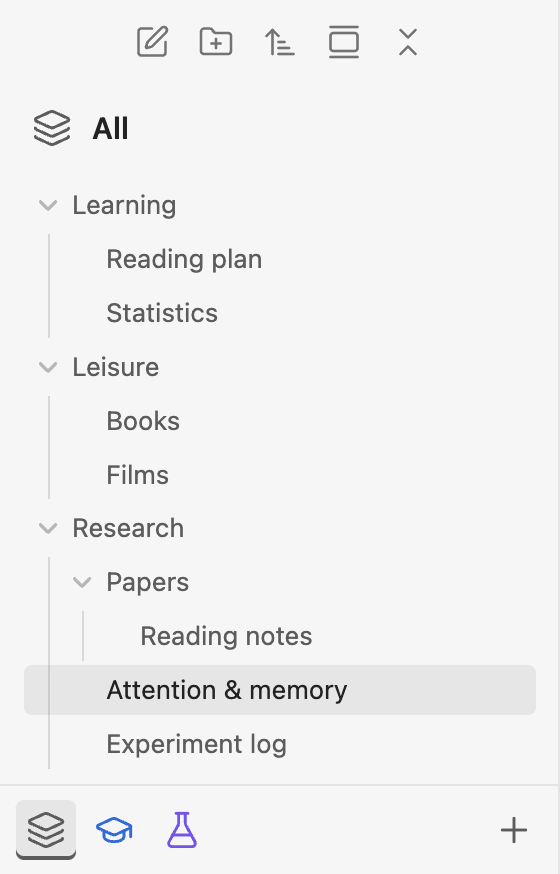
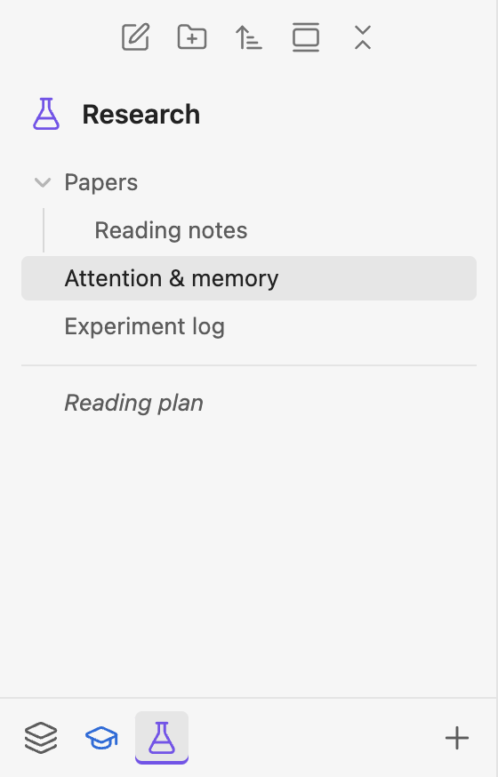
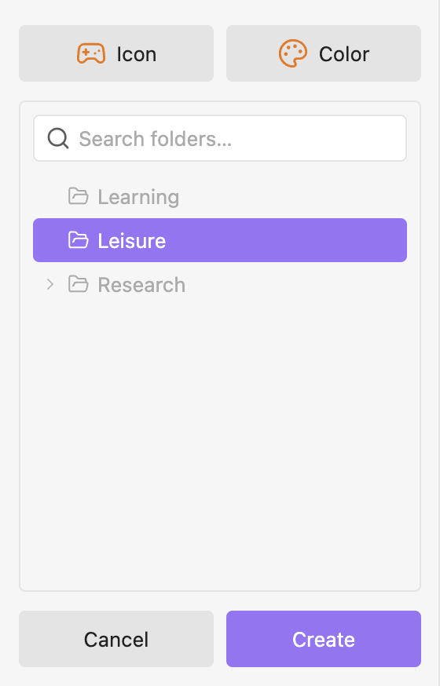

# Subvaults

<p align="center">
  <strong>English</strong> ·
  <a href="README.zh-Hans.md">简体中文</a>
</p>

Subvaults lets you browse folders as separate spaces in Obsidian while keeping one vault and one set of settings. Keep work, study, and personal notes together, and focus the file explorer on the folder you need.

Inspired by [obsidian-spaces](https://github.com/psjdev/obsidian-spaces).

## Features

- **Folder views.** Turn any folder into a subvault with its own icon and color. Its name follows the folder, including renames and moves.
- **Quick switching.** Switch views from the bottom of the file explorer; use **All** to browse the entire vault.
- **Native navigation.** Keep Obsidian's sorting, folder expansion, and file interactions. The file explorer's new-note and new-folder actions use the current subvault as their root.
- **Access to open files.** Open files outside the current subvault appear below a divider, with italic names.

<!-- screenshots:start -->

<table>
  <tr>
    <th width="33.33%">All</th>
    <th width="33.33%">Research</th>
    <th width="33.33%">Create a subvault</th>
  </tr>
  <tr>
    <td></td>
    <td></td>
    <td></td>
  </tr>
</table>

<!-- screenshots:end -->

## Installation

Requires Obsidian desktop 1.13.7 or later. The plugin interface is currently in English.

1. Open the [latest release](https://github.com/tlb-22/Obsidian-Subvaults/releases/latest). Download and extract the ZIP package, or download `main.js`, `manifest.json`, and `styles.css` individually.
2. Place those three files in `<vault>/.obsidian/plugins/subvaults/`, creating the folder if needed.
3. Reload Obsidian and enable **Subvaults** in **Settings → Community plugins**.

## Usage

1. Click **+** at the bottom of the file explorer.
2. Select a working folder. Use **Icon** and **Color** to customize its appearance.
3. Click **Create**, then use the bottom icons to switch views. Drag subvault icons to reorder them; the order is saved automatically.
4. Right-click a subvault icon to change its appearance or remove the view. Removing a subvault keeps its folder and files.

## Building from Source

Requires Node.js 24 or later and [pnpm](https://pnpm.io/installation), using the version pinned in `package.json`. From the project directory:

```sh
pnpm install --frozen-lockfile
pnpm run build
```

The plugin files are generated in `dist/`. See [project specifications](spec/Main.md) for development and verification details.

## License

[MIT](LICENSE)
