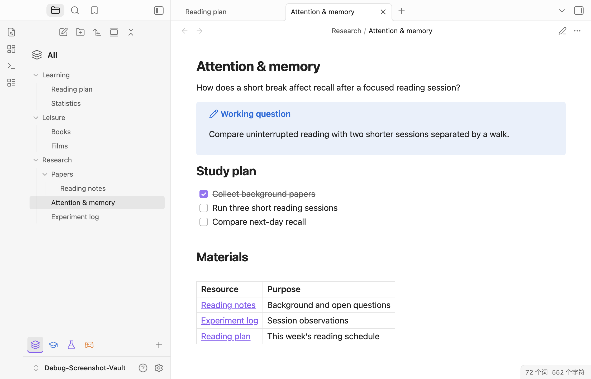
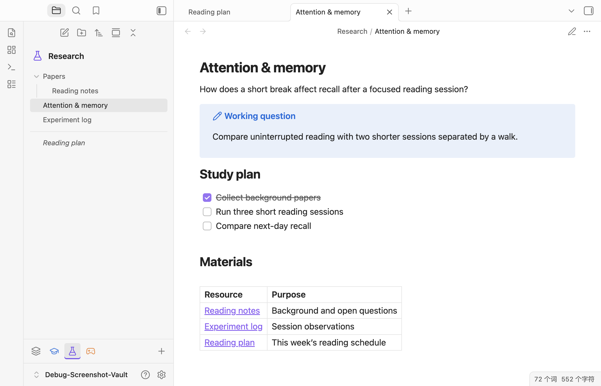

# Subvaults

<p align="center">
  <a href="README.md">English</a> ·
  <strong>简体中文</strong>
</p>

Subvaults 让你在 Obsidian 中将不同文件夹作为独立空间浏览，同时共用一个 vault 和一套设置。工作、学习和生活笔记可以放在一起，文件导航则聚焦于当前需要的文件夹。

本项目受到 [obsidian-spaces](https://github.com/psjdev/obsidian-spaces) 的启发。

## 功能

- **文件夹视图。** 将任意文件夹创建为 subvault，选择图标和颜色。名称跟随文件夹，重命名和移动后自动追踪。
- **快速切换。** 通过文件导航底部的图标切换视图，点击 **All** 查看整个 vault。
- **原生导航。** 沿用 Obsidian 的排序、文件夹展开状态和文件交互。文件导航中的新建笔记与新建文件夹操作以当前 subvault 为根目录。
- **访问已打开的文件。** 当前 subvault 之外的已打开文件显示在分割线下方，名称使用斜体。

<!-- screenshots:start -->

<p align="center">
  
</p>

<p align="center">
  
</p>

<!-- screenshots:end -->

## 安装

需要 Obsidian 桌面端 1.13.7 或更高版本。插件界面目前为英文。

1. 打开 [Latest Release](https://github.com/tlb-22/Obsidian-Subvaults/releases/latest)，下载并解压 ZIP 压缩包，或单独下载 `main.js`、`manifest.json` 和 `styles.css`。
2. 将这三个文件放入 `<vault>/.obsidian/plugins/subvaults/`，如果目录不存在则先创建。
3. 重新加载 Obsidian，在“设置 → 第三方插件”中启用 **Subvaults**。

## 使用

1. 点击文件导航底部的 **+**。
2. 选择工作文件夹，通过 **Icon** 和 **Color** 设置外观。
3. 点击 **Create**，随后使用底部图标切换视图。
4. 右键点击 subvault 图标可修改外观或移除视图。移除 subvault 会保留对应文件夹和文件。

## 源码构建

需要 Node.js 22 或更高版本。在项目目录执行：

```sh
npm ci
npm run build
```

插件文件生成在 `dist/` 中。开发与验证的详细说明见[项目规格](spec/Main.md)。
